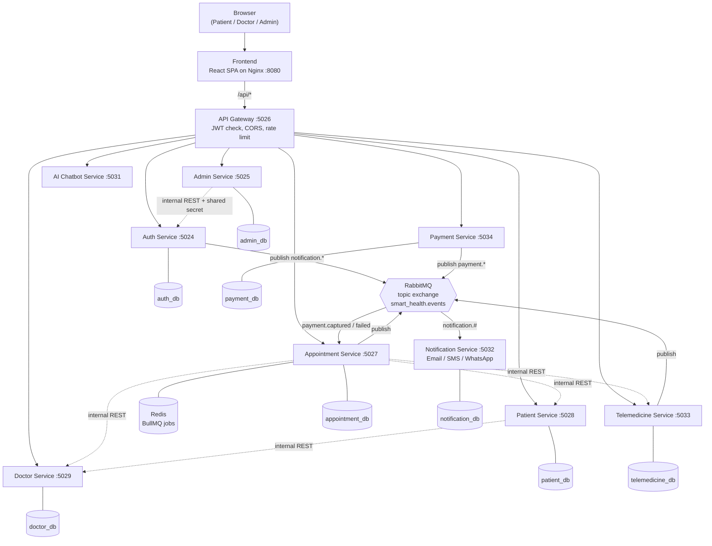
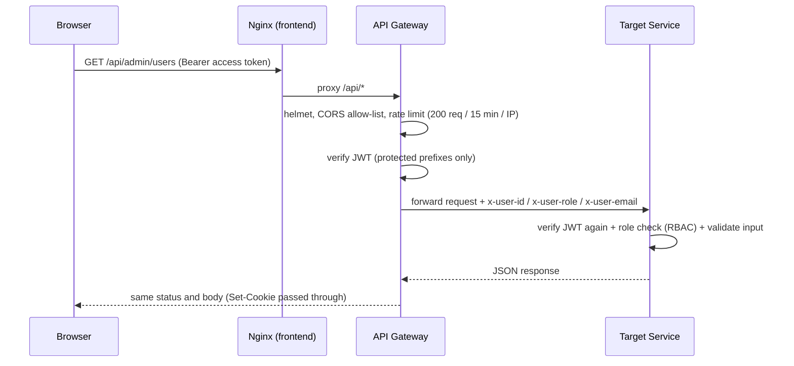
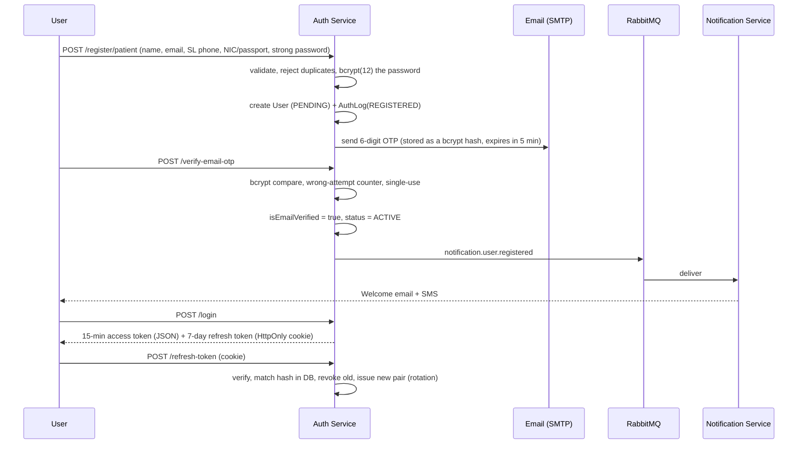
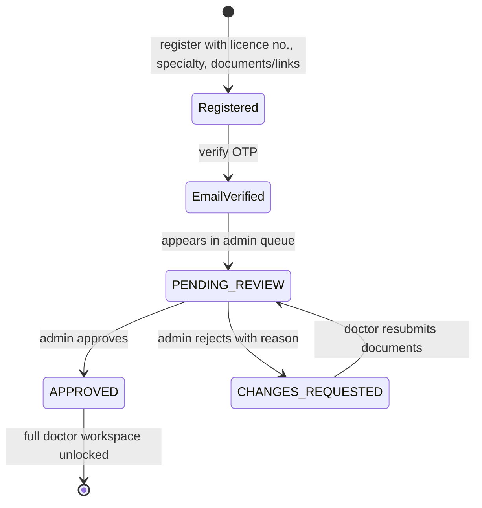
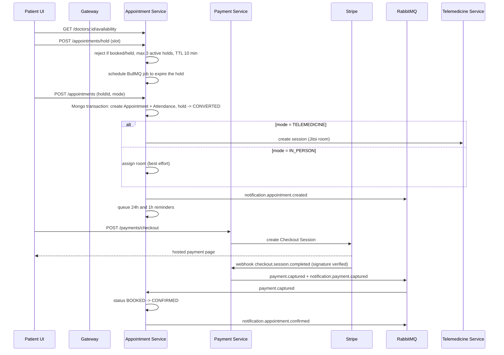
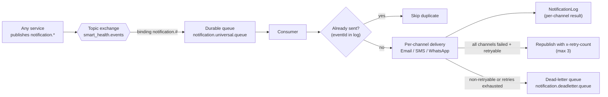

# Healio - Smart Health Care Platform

> **A microservices-based telehealth and appointment platform that connects patients, doctors, and administrators in one secure, event-driven system.**


---

## TL;DR

Healio lets a **patient** find a verified doctor, book a slot, pay online, and attend the consultation in person or by video. It lets a **doctor** prove their credentials, publish availability, accept bookings, run video consultations, and issue prescriptions. It gives an **admin** a control room: approve doctors, suspend accounts, watch platform health, and audit every security-relevant event.

Under the hood it is **10 backend services + a React frontend**, fronted by an **API Gateway**, talking over **REST** (synchronous) and **RabbitMQ** (asynchronous), packaged with **Docker Compose** and deployable on **Kubernetes**.

This was a **group project**. The [My Role](#3-my-role-and-contributions) section lists exactly what I built.

---

## Table of Contents

1. [The Story](#1-the-story)
2. [Who Benefits](#2-who-benefits)
3. [My Role and Contributions](#3-my-role-and-contributions)
4. [Tech Stack](#4-tech-stack)
5. [System Architecture](#5-system-architecture)
6. [How the System Works (End-to-End Flows)](#6-how-the-system-works-end-to-end-flows)
7. [Full Feature Walkthrough](#7-full-feature-walkthrough)
8. [Deep Dive: The Services I Built](#8-deep-dive-the-services-i-built)
9. [Security Implementation](#9-security-implementation)
10. [DevOps: Docker and Kubernetes](#10-devops-docker-and-kubernetes)
11. [API Quick Reference](#11-api-quick-reference)
12. [Run It Locally](#12-run-it-locally)
13. [Testing and Quality](#13-testing-and-quality)
14. [Repository Structure](#14-repository-structure)
15. [Challenges and Lessons Learned](#15-challenges-and-lessons-learned)
16. [Roadmap](#16-roadmap)
17. [Skills Demonstrated](#17-skills-demonstrated)
18. [Team](#18-team)

---

## 1. The Story

### The problem

Getting to a doctor is still a chain of small frustrations:

- You phone a clinic during office hours, hope someone picks up, and get a slot that may already be gone.
- You don't know if the doctor is actually qualified, or whether they take video consultations.
- Your previous lab reports live in a drawer, a WhatsApp chat, or a phone gallery, and you re-explain your history every visit.
- After the visit, the prescription is a piece of paper that is easy to lose.
- You find out about cancellations when you arrive.

On the other side of the desk, doctors juggle double-bookings and no-shows, and clinic administrators have no reliable way to **verify who is allowed to practise** on a platform or to see what is happening across it.

### The idea

**Healio** puts the whole journey in one place and makes each step safe and traceable:

1. **Trust first.** Doctors cannot go live until an admin has reviewed their licence and qualifications. Patients verify their email with a one-time password. Every sensitive action is logged.
2. **Booking that cannot double-book.** A patient first *holds* a slot (a short-lived reservation), then books it, then pays. Two people can never end up with the same slot.
3. **Care that isn't limited by distance.** The same booking flow produces either an in-person visit or a video consultation room.
4. **Nothing falls through the cracks.** Confirmations, cancellations, reminders, payment receipts, prescriptions, and account decisions trigger automatic email/SMS notifications through an event-driven pipeline.
5. **A first-class admin experience.** One dashboard for growth, verification pipeline, account health, and a unified security timeline.

### A day on Healio (illustrative)

> **Amara**, a patient, signs up, enters the 6-digit code emailed to her, and lands on her dashboard. She describes her symptoms to the **AI assistant**, which suggests a *Dermatologist* (with a clear "this is not a diagnosis" disclaimer). She searches dermatologists, checks ratings, and picks a video slot. The slot is held for 10 minutes while she pays through **Stripe**. The payment webhook fires, her appointment flips to *Confirmed*, and she gets an email and SMS.
>
> **Dr. Silva** registered last week and uploaded his licence. An **admin** reviewed the documents and approved him; he got an approval email. He sees Amara's booking in his dashboard, joins the Jitsi video room at the scheduled time, and issues a **digital prescription** afterwards. Amara sees it under *Prescriptions* the same day, and later leaves a review.
>
> Meanwhile the **admin** sees a new patient and a new doctor on the growth chart, and every login, approval, and suspension in the security timeline.

*(Names are fictional; the flow is real and implemented.)*

---

## 2. Who Benefits

| Beneficiary | What they get | Why it matters |
| --- | --- | --- |
| **Patients** | Search verified doctors, book/reschedule/cancel, pay online, attend by video, store medical reports, view prescriptions and history, AI-assisted triage, email/SMS updates | Less friction, no lost paperwork, transparent status at every step |
| **Doctors** | Verified professional profile, availability and blocked-date management, accept/reject requests, video consultations, prescriptions, access to patient-shared reports | Fewer no-shows and double-bookings, less admin work, a trusted marketplace |
| **Administrators** | Verification queue, user management (suspend/activate with reason), analytics dashboard, security timeline, admin-account management | Platform safety and accountability, with an immutable trail of who decided what |
| **Super administrators** | Create and remove admin accounts under strict guardrails | Controlled privilege escalation |
| **Clinics and hospitals** | Digital scheduling, rooms for in-person visits, attendance tracking, emergency resources directory | Better utilisation and operational visibility |
| **Developers and the team** | Independent services, clear contracts, one-command local stack, Kubernetes manifests | Faster parallel work and safer deployments |

**Sri Lankan context is built in:** NIC / passport identity capture, Sri Lankan mobile-number validation and normalisation, and a local SMS gateway (Notify.lk).

---

## 3. My Role and Contributions

This is a team project. These are the parts **I** designed and built:

| Area | What I delivered |
| --- | --- |
| **`auth-service`** | Identity and access for the whole platform: patient and doctor registration, email OTP verification, login with account lockout, JWT access tokens plus rotating refresh tokens in HttpOnly cookies, forgot/reset password, doctor verification document upload and resubmission, an audit log, and the internal admin API consumed by `admin-service`. |
| **`admin-service`** | The admin domain: dashboard analytics, user management, doctor approval/rejection, admin-account management (super admin only), admin profile and password, and a unified security activity feed. Owns its own database for the admin audit trail and talks to `auth-service` over a secured internal API. |
| **API Gateway initialization** | The single public entry point: reverse proxy to all services, edge JWT verification, CORS allow-list, rate limiting, security headers, identity header propagation, and upstream error mapping. |
| **Security implementation** | Password hashing, hashed OTPs and refresh tokens, brute-force protection, RBAC, service-to-service secret, upload validation, input validation, audit logging, secrets handling for Docker and Kubernetes. See [section 9](#9-security-implementation). |
| **Docker and Kubernetes setup** | Dockerfiles for every service, the full `docker-compose.yml` stack, the frontend Nginx image, the Kubernetes manifests (namespace, ConfigMap, Secrets generation, Deployments, Services, probes, Ingress, Kustomize), and the runbook. See [section 10](#10-devops-docker-and-kubernetes). |
| **`notification-service` (auth/admin lifecycle events)** | The event contract, publishers, and email + SMS templates for **five** notifications: **patient welcome**, **doctor approved**, **doctor rejected / changes requested**, **account suspended**, **account reactivated**. Includes a shared branded HTML email layout and a smoke-test publisher. |

**What I did not build:** the patient, doctor, appointment, payment, telemedicine and AI-chatbot services, and the remaining notification event types. They are described below so the whole system makes sense, and were built by my teammates.

---

## 4. Tech Stack

### Frontend
| Concern | Technology |
| --- | --- |
| UI framework | **React 19** with **Vite 8** |
| Routing | **React Router 7** (role-protected routes, nested layouts) |
| Styling and motion | **Tailwind CSS 4**, **Framer Motion**, **Lucide** icons |
| Forms and validation | **React Hook Form** + **Zod** |
| Data viz | **Recharts** (admin analytics) |
| HTTP | **Axios** with request/response interceptors (token attach, single-flight refresh) |
| Feedback | **react-hot-toast** |
| Serving | **Nginx** (static SPA + `/api` reverse proxy) |

### Backend
| Concern | Technology |
| --- | --- |
| Runtime and framework | **Node.js 22**, **Express 5** (ES modules) |
| Database | **MongoDB** with **Mongoose 9** (database-per-service) |
| Auth | **JSON Web Tokens**, **bcryptjs**, **cookie-parser** (HttpOnly refresh cookie) |
| Validation | **express-validator** |
| Security middleware | **Helmet**, **CORS**, **express-rate-limit** |
| Messaging | **RabbitMQ** (topic exchange, `amqplib`) |
| Queues and cache | **Redis** + **BullMQ** (slot-hold expiry, reminders, waitlist promotion) |
| Payments | **Stripe** (Checkout Sessions + signed webhooks) |
| Files | **Cloudinary** (documents, reports, photos) via **Multer** |
| Email / SMS / WhatsApp | **Nodemailer** (SMTP), **Notify.lk**, **Twilio** |
| AI | **Google Gemini** API |
| Video | **Jitsi Meet** rooms (Google Meet fallback) |
| API docs | **Swagger UI / OpenAPI** (appointment-service) |
| Testing | Node's built-in test runner, **Jest**, **Supertest**, **mongodb-memory-server**, Postman collections |

### DevOps
| Concern | Technology |
| --- | --- |
| Containers | **Docker** (Alpine images, `npm ci --omit=dev`, multi-stage for frontend) |
| Local orchestration | **Docker Compose** (13 containers) |
| Cluster orchestration | **Kubernetes** + **Kustomize**, **NGINX Ingress** |
| Config and secrets | ConfigMap, Secret (generated from `.env` by a PowerShell script), `.gitignore`d secret file |
| Health | `/health` on every service, wired to readiness and liveness probes |

---

## 5. System Architecture



### Service catalogue

| Service | Port | Responsibility | Owns data? |
| --- | ---: | --- | --- |
| Frontend (Nginx) | 8080 | React SPA; proxies `/api/*` to the gateway | no |
| **API Gateway** | 5026 | Single public entry point, edge auth, rate limiting | no |
| **Auth Service** | 5024 | Identity, OTP, tokens, doctor verification, audit log | `Users`, `Otp`, `RefreshToken`, `AuthLog` |
| **Admin Service** | 5025 | Admin workflows, analytics, security feed | `AdminAction` |
| Patient Service | 5028 | Patient profile, medical reports, history, prescriptions view | `Patient` |
| Doctor Service | 5029 | Doctor profile, availability, prescriptions, appointment responses | `Doctor`, `Availability`, `Prescription` |
| Appointment Service | 5027 | Slot holds, booking lifecycle, waitlist, feedback, emergency, reminders | `Appointment`, `SlotHold`, `Waitlist`, `Feedback`, ... |
| Payment Service | 5034 | Stripe checkout, webhooks, payment state | `Payment` |
| Telemedicine Service | 5033 | Video session lifecycle (Jitsi) | `Session` |
| AI Chatbot Service | 5031 | Gemini-based triage assistant | none (in-memory chat context) |
| **Notification Service** | 5032 | Consume events, send email/SMS/WhatsApp, delivery log | `NotificationLog` |
| RabbitMQ | 5672 / 15672 | Event bus and management UI | n/a |
| Redis | 6379 | Job queues and delayed jobs | n/a |

### Design principles

| Principle | How it shows up |
| --- | --- |
| **One door in** | Only the gateway (and the frontend Nginx) is meant to be reached by clients. Internal `/internal/*` endpoints are **not** mounted on the gateway. |
| **Database per service** | No service reads another service's collections. They call each other's APIs. |
| **Defence in depth** | The gateway verifies the JWT, and each service **verifies it again** and enforces its own roles. |
| **Sync where you need an answer, async where you don't** | REST for reads and commands; RabbitMQ for notifications and payment results. |
| **Failure-tolerant side effects** | Notifications are fire-and-forget: a mail outage never blocks a doctor approval or a booking. |
| **Idempotency** | Notification events carry an `eventId`; Stripe webhook events are de-duplicated; payments cannot be captured twice. |

---

## 6. How the System Works (End-to-End Flows)

### 6.1 Request lifecycle



If an upstream is down the gateway answers **503**; on timeout **504**, with a clean JSON error.

### 6.2 Register, verify, log in, stay logged in



**Frontend behaviour:** an Axios interceptor attaches the Bearer token; on a `401` it performs **one shared refresh call** (concurrent requests wait for the same promise), retries the original request once, and if refresh fails it broadcasts a global "auth expired" event that clears the session and sends the user to login.

### 6.3 Doctor onboarding and verification (state machine)



- A **pending** doctor cannot log in ("pending admin approval").
- A doctor in **changes requested** *can* log in, but only into a **restricted** session: the frontend (`DoctorVerificationAccess`) force-redirects them to the **resubmission page** where they see the admin's reason and upload new documents.
- Approval or rejection updates the account, writes an audit log, records an `AdminAction`, and publishes `notification.doctor.approved` / `notification.doctor.rejected`.

### 6.4 Booking, payment, confirmation, consultation



Other lifecycle rules in the appointment service: **cancel** (with a configurable cut-off, default 12 h, admins can override), **reschedule**, **attendance confirmation** by both sides, **no-show**, **complete**, and **waitlist promotion** when a cancelled slot frees up.

### 6.5 Notification pipeline



### 6.6 Telemedicine session lifecycle

`scheduled` -> first participant joins -> `waiting` -> both joined -> `active` -> `completed` (duration auto-calculated, optional notes/outcome) or `cancelled`. Only the session's own patient and doctor (or an admin, read-only) can access it. When the session turns active, both parties receive a "your video session is live" notification with the room link.

### 6.7 AI triage assistant

The patient describes symptoms; the service builds a prompt from the **last few messages of context**, asks Gemini for **strict JSON** (`reply` + `suggestedSpecialty`), then:

- forces the specialty into an **allow-list of 12 specialties** (falls back to *General Physician*),
- guarantees a **"not a diagnosis, please consult a licensed doctor"** disclaimer is always present,
- retries transient failures with exponential back-off and **falls back across models**,
- maps API-key / rate-limit / model-unavailable errors to clear, safe messages.

---

## 7. Full Feature Walkthrough

### 7.1 Public area

| Page | Route | What it does |
| --- | --- | --- |
| Landing page | `/` | Product story, the four pillars of care, how-it-works journey, smart scheduling, security section, call to action |
| Register | `/register` | Patient or doctor sign-up. Patients may add NIC *or* passport + nationality. Doctors go through a **multi-step wizard**: medical licence, specialty, experience, then upload up to **5 documents** and/or add up to **5 verification links** |
| Verify OTP | `/verify-otp` | Enter the 6-digit email code; resend with cooldown |
| Login | `/login` | Role-aware redirect (patient, doctor, admin) |
| Forgot / Reset password | `/forgot-password`, `/reset-password` | OTP-based reset with the same password policy |
| Find doctors | `/doctor-search` | Public search/filter of doctors, with ratings and reviews (public reviews endpoint) |
| Unauthorized / Not found | `/unauthorized`, `*` | Friendly guard pages |

### 7.2 Patient workspace (role: `PATIENT`)

| Screen | Route | Capabilities |
| --- | --- | --- |
| Home | `/patient/home` | Welcome and quick links |
| Dashboard | `/dashboard` | Care journey overview, records, quick entry to AI triage |
| Find a doctor | `/patient/find-doctor` | Search by specialty, view profiles |
| Book appointment | `/patient/book-appointment` | Pick date/slot from live availability, choose in-person or telemedicine, slot is **held** then **booked** |
| Checkout | `/patient/checkout` | Redirect to Stripe Checkout |
| Booking confirmation | `/patient/booking-confirmation` | Success state after payment |
| My appointments | `/patient/appointments` | Upcoming and past, **cancel**, **reschedule**, **confirm attendance**, **join video session** |
| Completed bookings | `/patient/bookings` | Past visits and **leave a review/rating** |
| Appointment history | `/history` | Timeline of previous consultations |
| Medical reports | `/reports` | **Upload** (PDF, images, Word; size-limited), list, download, delete. Stored on Cloudinary |
| Prescriptions | `/prescriptions` | Diagnosis, instructions and medicines issued by doctors |
| Profile | `/profile` | Date of birth, blood group, contact, address, allergies, medical notes (auto-created on first visit) |
| AI chat | `/ai-chat` | Symptom triage and a suggested specialty |
| Service tools | `/patient/tools` | Waitlist, feedback, and payment utilities |

### 7.3 Doctor workspace (role: `DOCTOR`, verified)

| Screen | Route | Capabilities |
| --- | --- | --- |
| Verification resubmission | `/doctor/verification/resubmit` | Shown to unverified/changes-requested doctors: see the admin's feedback, upload new documents/links, resubmit |
| Dashboard | `/doctor/dashboard` | Appointment overview |
| Pending requests | `/doctor/pending` | **Accept or reject** (with reason) incoming bookings |
| Confirmed schedule | `/doctor/schedule` | Upcoming confirmed visits, mark **completed** |
| Completed | `/doctor/completed` | History of finished consultations |
| Telemedicine sessions | `/doctor/sessions` | List sessions and join |
| Video consultation | `/doctor/consultation/:appointmentId` | Embedded Jitsi room |
| Prescription | `/doctor/prescription/:appointmentId` | Issue medicines (name, dose, frequency, duration, notes) |
| Availability | `/doctor/availability` | Weekly schedule (days, hours, slot length, mode), blocked dates and off days |
| Profile | `/doctor/profile` | Bio, fee, qualifications, profile photo, qualification uploads |

Doctors can also view reports a patient has shared in connection with an appointment.

### 7.4 Admin console (roles: `ADMIN`, `SUPER_ADMIN`)

| Screen | Route | Capabilities |
| --- | --- | --- |
| **Dashboard** | `/admin` | KPI cards (total users, patients, doctors, pending reviews); **14-day user-growth** chart; role distribution; **doctor verification pipeline** (approved / pending / changes requested / rejected); account-health panel (active and suspended accounts, pending doctors, recent approvals); latest admin decisions with approvals / changes-requested / suspensions counters |
| **Pending doctors** | `/admin/doctors/pending` | Review each doctor's licence number, specialty, experience, **uploaded documents and links**; **Approve** or **Request changes** (reason is mandatory, 3-500 chars) |
| **Users** | `/admin/users` | Server-side search by name/email; filter by role and account status; pagination; **Suspend** (reason mandatory) / **Activate** |
| **Admins** *(super admin only)* | `/admin/admins` | List, create, and delete administrators |
| **Profile** | `/admin/profile` | Edit name, phone, job title; upload/remove profile photo; change password (revokes all sessions) |
| **Security** | `/admin/security` | One chronological feed combining **authentication events** (logins, failures, OTPs, resets) and **admin decisions**, with IP and user-agent |

Every admin action is recorded twice: in the **auth audit log** (what happened to the account) and in the **admin action log** (who decided it, and why).

### 7.5 Platform capabilities (behind the screens)

- **Slot holds and double-booking protection** (Redis-backed delayed expiry, per-patient hold cap, DB transaction on booking).
- **Waitlist** with automatic promotion when a slot is released.
- **Automatic reminders** at 24 h and 1 h before the appointment (BullMQ delayed jobs).
- **Reviews and ratings** with moderation (visible / hidden / flagged / deleted).
- **Emergency module**: emergency alerts and a public directory of hospitals, ambulance, helplines, police, and fire services.
- **Notification preferences** per user (email / SMS / WhatsApp toggles, locale, timezone).
- **Full appointment audit trail** (who changed what, old value to new value).
- **Interactive API docs** (Swagger UI) for the appointment service.
- **Payment safety**: signed Stripe webhooks, webhook-event de-duplication, no double capture.

---

## 8. Deep Dive: The Services I Built

### 8.1 Auth Service (`:5024`)

**Public endpoints** (reached as `/api/auth/*` through the gateway)

| Method | Path | Purpose |
| --- | --- | --- |
| POST | `/register/patient` | Register a patient (validated identity, strong password) |
| POST | `/register/doctor` | Register a doctor (multipart: up to 5 files, MIME-filtered) |
| POST | `/doctor/verification/resubmit` | Doctor re-uploads documents after changes requested |
| POST | `/verify-email-otp` / `/resend-email-otp` | Email verification |
| POST | `/login` | Authenticate; returns access token, sets refresh cookie |
| GET | `/me` | Current user (JWT) |
| POST | `/forgot-password` / `/reset-password` | OTP-based reset |
| POST | `/refresh-token` | Rotate refresh token, mint new access token |
| POST | `/logout` | Revoke refresh token, clear cookie |

**Internal endpoints** (`/internal/admin/*`, guarded by `x-internal-service-secret`, never exposed by the gateway): admin profile, photo, password; list/create/delete admins; list users; auth logs; pending doctors; approve/reject doctor; update user status; dashboard counts.

**Data model**

| Collection | Key fields |
| --- | --- |
| `User` | `role` (PATIENT, DOCTOR, ADMIN, SUPER_ADMIN), `accountStatus` (PENDING, ACTIVE, SUSPENDED, LOCKED), `doctorVerificationStatus` (NOT_REQUIRED, PENDING, APPROVED, CHANGES_REQUESTED, REJECTED), `isEmailVerified`, identity (NIC *or* passport, unique sparse indexes), doctor licence/specialty/documents/links, `failedLoginAttempts`, `lockUntil`, review metadata |
| `Otp` | `email`, `purpose` (EMAIL_VERIFY / PASSWORD_RESET), **hashed** code, `expiresAt`, `used`, `failedAttempts`, `blockedUntil` |
| `RefreshToken` | `userId`, **hashed** token, `expiresAt`, `revoked` |
| `AuthLog` | `userId`, `email`, `action`, `ipAddress`, `userAgent`, `metadata` |

**Behaviour worth highlighting**

- **Account state resolution** on every login: handles locked-then-expired, suspended, unverified, and doctor-not-approved cases in one place.
- **Transactional file handling**: if a doctor registration fails after documents were uploaded to Cloudinary, the uploads are **rolled back**; on resubmission the old documents are deleted only after the new ones are saved.
- **Graceful OTP failure**: if the mail server is down at registration, the account is still created and the API returns a "use resend OTP shortly" response instead of a 500.
- **Login hygiene**: unknown email and wrong password produce the *same* generic error; every outcome is audit-logged with IP and user-agent.

### 8.2 Admin Service (`:5025`)

| Concern | Implementation |
| --- | --- |
| **Role** | Orchestrator for the admin domain. It does **not** share a database with auth; it calls `auth-service` internal endpoints through a dedicated Axios client. |
| **Resilience** | 5 s timeout, up to 2 retries with linear back-off on timeouts/resets, and clean translation of upstream failures into `502 / 503 / 504` with machine-readable codes. |
| **Access control** | `protect` + `allowRoles("ADMIN","SUPER_ADMIN")` on the whole router; admin management is `SUPER_ADMIN` only. For profile and admin-account operations, `auth-service` additionally **re-checks in the database** that the acting user is an *active* admin (and a super admin where required). |
| **Guardrails** | A super admin cannot delete their own account or the **last** super admin; suspension and rejection require a reason; new admin passwords follow the same policy as everyone else. |
| **Audit** | Every decision writes an `AdminAction` (actor, target, action, reason, timestamp). |
| **Analytics** | Aggregates counts from auth and merges them with local data into one dashboard payload (growth series, role split, verification pipeline, account-status breakdown, recent actions, action trend). |
| **Security feed** | Merges `AuthLog` entries (from auth-service) and `AdminAction` entries (local) into one sorted, paginated timeline. |
| **Uploads** | Admin profile photos are **streamed through** to auth-service (no buffering in admin-service). |

### 8.3 API Gateway (`:5026`)

| Route prefix | Target | Access |
| --- | --- | --- |
| `/api/auth` | Auth | Public |
| `/api/doctors` | Doctor | Public |
| `/api/feedback/doctors`, `/api/emergency-resources` | Appointment | Public |
| `/api/admin` | Admin | JWT |
| `/api/patients` | Patient | JWT |
| `/api/ai` | AI Chatbot | JWT |
| `/api/appointments`, `/api/feedback`, `/api/waitlist`, `/api/emergency-alerts`, `/api/notifications` | Appointment | JWT |
| `/api/sessions` | Telemedicine | JWT |
| `/api/prescriptions` | Doctor | JWT |
| `/api/payments` | Payment | JWT |

- **Order matters:** the public `/api/feedback/doctors` route is mounted *before* the protected `/api/feedback`.
- A lightweight **fetch-based reverse proxy** forwards headers, streams multipart uploads, passes `Set-Cookie` back to the browser, and adds `x-user-id`, `x-user-role`, `x-user-email` for authenticated requests.
- **Helmet**, **CORS allow-list** (comma-separated `CLIENT_URL`, credentials enabled), **global rate limit** (200 requests / 15 min / IP), and `trust proxy` for correct client IPs behind Nginx or an ingress.
- **Configuration only through environment variables**, so the same image runs in Compose and Kubernetes.

### 8.4 Notification events I own

| Routing key | Trigger | Recipient | Channels |
| --- | --- | --- | --- |
| `notification.user.registered` | Patient verifies email | Patient | Email + SMS |
| `notification.doctor.approved` | Admin approves doctor | Doctor | Email + SMS |
| `notification.doctor.rejected` | Admin requests changes (with reason) | Doctor | Email + SMS |
| `notification.account.suspended` | Admin suspends a user (with reason) | That user | Email + SMS |
| `notification.account.reactivated` | Admin re-activates a user | That user | Email + SMS |

- **Event envelope:** `eventId` (UUID), `occurredAt`, recipient blocks (`patient` / `doctor` / `recipient`), plus metadata such as `accountStatus`, `reason`, `adminUserId`.
- **Publish is fire-and-forget** (`publishNotificationEventSafely`): a broker problem is logged but never fails the business operation.
- **Templates:** a shared, responsive **HTML email layout** (badge, tone, highlights table, footer) and short **SMS** messages for each event.
- **Smoke tool:** `node test-publish.mjs notification.doctor.approved` publishes a sample event so the pipeline can be verified without running the full stack.
- **Design note:** OTP emails intentionally stay inside `auth-service` (they are synchronous, security-critical, and must not depend on the broker); everything else goes through events. See [`auth-notification-events.md`](./auth-notification-events.md).

*The shared consumer that these events flow through (queue, retries, dead-letter handling, idempotency, delivery log) was built by teammates and is described in [6.5](#65-notification-pipeline).*

---

## 9. Security Implementation

| Layer | Control | Where |
| --- | --- | --- |
| **Passwords** | bcrypt with cost factor **12**; policy: 8+ chars with upper, lower, digit, special | auth-service, admin validation |
| **OTP** | 6 digits, **stored hashed**, **5-minute expiry**, single use, previous codes invalidated on re-issue, **60 s resend cool-down**, **5 requests / 15 min** per email+purpose, **5 wrong attempts -> 15 min block** | auth-service |
| **Brute-force defence** | **5 failed logins -> account LOCKED for 15 min**, auto-unlock, counters reset on success | auth-service |
| **Access tokens** | JWT, **15 min** lifetime, signed with a dedicated secret | auth-service, verified by gateway and every service |
| **Refresh tokens** | **7-day**, unique `jti`, **hashed in DB**, **rotated on every use**, revoked on logout, **all revoked on password reset/change** | auth-service |
| **Cookies** | `HttpOnly`, `SameSite=Strict`, `Secure` in production | auth-service |
| **RBAC** | `PATIENT`, `DOCTOR`, `ADMIN`, `SUPER_ADMIN` enforced per route; super-admin-only admin management | gateway + services |
| **Defence in depth** | Edge JWT check **and** per-service JWT check; for admin-profile and admin-account operations the acting admin is also re-validated against the DB | gateway, admin, auth |
| **Service-to-service trust** | `x-internal-service-secret` on every `/internal/*` endpoint; internal routes never mounted on the gateway | auth, patient, doctor, telemedicine |
| **Input validation** | express-validator on every write: email, Sri Lankan phone normalisation, NIC regex (old and new formats), passport format, mutual-exclusion rules, ObjectId checks, length limits, enum checks | auth, admin |
| **Upload safety** | MIME allow-list (PDF, PNG, JPEG, DOC/DOCX), size limits (10 MB docs, 5 MB photos, configurable), max file count, in-memory handling, Cloudinary cleanup on failure | auth, patient, doctor |
| **HTTP hardening** | Helmet headers, strict CORS allow-list with credentials, request rate limiting | gateway, services |
| **Auditability** | `AuthLog` (IP + user-agent) and `AdminAction` (actor, target, reason) with a unified viewer | auth, admin |
| **Payments** | Stripe webhook **signature verification**, idempotent event handling, no double capture | payment-service |
| **Secrets** | Nothing committed: `.env`, `k8s/secret.yaml` are git-ignored; Kubernetes Secret generated from `.env` by script; ConfigMap holds only non-secret values | repo, k8s |

---

## 10. DevOps: Docker and Kubernetes

### 10.1 Docker

- **One Dockerfile per service** on `node:22-alpine`, using `npm ci --omit=dev` for small, reproducible images; some use a two-stage build to keep dev tooling out of the runtime layer.
- **Frontend image:** multi-stage. Stage 1 builds the Vite bundle with `VITE_API_BASE_URL=/api`; stage 2 serves it from `nginx:1.27-alpine`.
- **Nginx config:** SPA fallback (`try_files ... /index.html`), `/api/` reverse proxy to `api-gateway:5026`, and a 12 MB body limit so report uploads pass through.

### 10.2 Docker Compose (13 containers)

`docker compose up --build -d` starts the **frontend, API gateway, auth, admin, patient, doctor, appointment, payment, telemedicine, notification, AI chatbot, RabbitMQ and Redis**.

- Every port is **configurable** via environment variables with sensible defaults.
- Services address each other by **DNS name** (`http://auth-service:5024`), not `localhost`.
- `restart: unless-stopped`, `depends_on` ordering, and a root `.env.docker.example` documenting every variable group (ports, JWT, internal secret, per-service Mongo URIs, SMTP, Cloudinary, Gemini, RabbitMQ, SMS/WhatsApp, Stripe).

### 10.3 Kubernetes

```text
k8s/
|-- namespace.yaml            # smart-health
|-- configmap.yaml            # non-secret config: service URLs, TTLs, limits, models
|-- secret.example.yaml       # safe template (real secret.yaml is git-ignored)
|-- <service>.yaml            # Deployment + ClusterIP Service per microservice
|-- rabbitmq.yaml, redis.yaml # in-cluster infrastructure
|-- frontend.yaml
|-- ingress.yaml              # NGINX ingress, host smart-health.local
|-- auth-mongo.yaml, admin-mongo.yaml   # optional in-cluster Mongo with PVC
|-- kustomization.yaml        # one command deploys everything
|-- COMMANDS.md               # operator runbook
```

Highlights:

- **Config vs secrets are separated.** The ConfigMap carries URLs, token lifetimes, OTP limits, slot-hold TTLs, etc.; the Secret carries Mongo URIs, JWT secrets, SMTP, Cloudinary, Gemini, SMS and Twilio credentials.
- **`scripts/generate-k8s-secret.ps1`** builds `k8s/secret.yaml` from `.env`: validates that every required key exists, applies safe placeholders for optional integrations, and correctly escapes YAML values.
- **Probes:** every service exposes `/health` and uses it for **readiness and liveness** probes.
- **Resource limits** are set on the AI service; **Ingress** body size is raised for uploads.
- **External MongoDB** (e.g. Atlas) by default via Secret; optional in-cluster Mongo with a **PersistentVolumeClaim** is included.
- **Kustomize:** `kubectl apply -k ./k8s` deploys the whole platform.
- **Runbook:** `k8s/COMMANDS.md` covers first-time setup, port-forwarding, rolling a single service (`rollout restart`), reading logs, debugging `CrashLoopBackOff` / `ImagePullBackOff`, and adding a new microservice step by step.

```powershell
# Docker Compose
docker compose up --build -d

# Kubernetes (Docker Desktop)
.\scripts\generate-k8s-secret.ps1
docker compose build
kubectl apply -k .\k8s
kubectl wait --for=condition=ready pod --all -n smart-health --timeout=180s
kubectl port-forward svc/frontend 8081:80 -n smart-health
```

---

## 11. API Quick Reference

All client calls go through the gateway at `http://localhost:5026/api/...`.

<details>
<summary><strong>Auth</strong> (<code>/api/auth</code>)</summary>

| Method | Path | Auth |
| --- | --- | --- |
| POST | `/register/patient`, `/register/doctor` | none |
| POST | `/verify-email-otp`, `/resend-email-otp` | none |
| POST | `/login`, `/refresh-token`, `/logout` | none / refresh cookie |
| POST | `/forgot-password`, `/reset-password` | none |
| GET | `/me` | JWT |
| POST | `/doctor/verification/resubmit` | JWT (DOCTOR) |
</details>

<details>
<summary><strong>Admin</strong> (<code>/api/admin</code>, roles ADMIN / SUPER_ADMIN)</summary>

| Method | Path | Notes |
| --- | --- | --- |
| GET / PATCH | `/profile` | Own profile |
| POST / DELETE | `/profile/photo` | Upload / remove photo |
| PATCH | `/profile/password` | Revokes sessions |
| GET | `/users` | Search, filter, paginate |
| GET | `/doctors/pending` | Verification queue |
| PATCH | `/doctors/:id/approve`, `/doctors/:id/reject` | Reject requires reason |
| PATCH | `/users/:id/status` | `ACTIVE` or `SUSPENDED` (reason required to suspend) |
| GET | `/dashboard/stats` | Dashboard payload |
| GET | `/security/activity`, `/actions` | Audit feeds |
| GET / POST / DELETE | `/admins`, `/admins/:id` | SUPER_ADMIN only |
</details>

<details>
<summary><strong>Appointments, payments, sessions, others</strong></summary>

| Area | Key endpoints |
| --- | --- |
| Appointments | `POST /appointments/hold`, `POST /appointments`, `PATCH /appointments/:id/{cancel,reschedule,confirm-attendance,respond,complete,no-show}`, `GET /appointments`, `GET /appointments/:id/telemedicine` |
| Doctors | `GET /doctors`, `GET /doctors/:id`, `GET /doctors/:id/availability`, `PATCH /doctors/:id/{profile,availability}` |
| Patients | `GET/PUT /patients/profile`, `GET/POST/DELETE /patients/reports`, `GET /patients/{history,prescriptions}` |
| Prescriptions | `POST /prescriptions` (doctor), `GET /prescriptions` (patient) |
| Payments | `POST /payments/checkout`, `GET /payments/appointment/:id` |
| Sessions | `GET /sessions/doctor/my-sessions`, `POST /sessions/:id/join`, `GET /sessions/appointment/:id` |
| Feedback / waitlist | `POST /feedback`, `GET /feedback/doctors/:id/reviews` (public), `POST /waitlist` |
| AI | `POST /ai/chat` |
</details>

Interactive docs for the appointment service: `http://localhost:5027/api/docs` (Swagger UI). Postman collections live in [`docs/`](.).

---

## 12. Run It Locally

**Prerequisites:** Node.js 20+, Docker Desktop, a MongoDB connection string per service (Atlas works), and accounts/keys for the integrations you want to exercise (SMTP, Cloudinary, Gemini, Stripe, Notify.lk / Twilio).

```powershell
# 1. Configure
Copy-Item .\.env.docker.example .\.env                          # then fill in real values
Copy-Item .\backend\telemedicine-service\.env.example .\backend\telemedicine-service\.env

# 2. Start the whole platform
docker compose up --build -d

# 3. Create the first super admin (local development only; rotate its credentials immediately)
cd backend/auth-service
npm install
npm run seed:admin
```

| URL | What |
| --- | --- |
| `http://localhost:8080` | Web app |
| `http://localhost:5026/health` | Gateway health |
| `http://localhost:5027/api/docs` | Appointment service Swagger UI |
| `http://localhost:15672` | RabbitMQ management (local default login) |

**Develop a single service:** `docker compose up -d rabbitmq redis`, then `npm install && npm run dev` inside the service folder (or `frontend/`).

**Verify the notification pipeline without the UI:**

```powershell
cd backend/notification-service
node test-publish.mjs notification.doctor.approved
```

---

## 13. Testing and Quality

| What | How |
| --- | --- |
| Unit tests (auth and admin services) | Node's built-in test runner: phone normalisation, doctor-verification helpers, dashboard analytics builders, security-activity feed merging |
| Appointment service | Jest + Supertest + `mongodb-memory-server` (date/time utilities, health endpoint) |
| API testing | Postman collections for doctor and appointment flows (`docs/`) |
| Event pipeline | `test-publish.mjs` smoke publisher + RabbitMQ management UI |
| Static analysis | ESLint on the frontend (`npm run lint`) |
| Runtime health | `/health` on every service, used by Docker and Kubernetes probes |

```powershell
cd backend/auth-service  ; npm test
cd backend/admin-service ; npm test
cd frontend              ; npm run lint ; npm run build
```

---

## 14. Repository Structure

```text
.
|-- backend/
|   |-- api-gateway/            # edge proxy, auth, rate limit
|   |-- auth-service/           # identity, OTP, tokens, audit, internal admin API
|   |-- admin-service/          # admin workflows, analytics, security feed
|   |-- patient-service/
|   |-- doctor-service/
|   |-- telemedicine-service/
|   |-- ai-chatbot-service/
|   |-- notification-service/   # consumer, templates, channels
|   `-- services/
|       |-- appointment-service/
|       `-- payment-service/
|-- frontend/                   # React SPA + Nginx
|-- k8s/                        # Kubernetes manifests + runbook
|-- scripts/                    # generate-k8s-secret.ps1
|-- docs/                       # reports, Postman collections, event docs
|-- docker-compose.yml
`-- .env.docker.example
```

Each backend service follows the same layered layout, which keeps the codebase predictable across a team:

```text
src/
|-- config/        # env, db, rabbitmq
|-- routes/        # URL -> controller, plus validation and RBAC middleware
|-- controllers/   # HTTP in/out only
|-- services/      # business logic
|-- models/        # Mongoose schemas
|-- validations/   # express-validator chains
|-- middlewares/   # auth, roles, errors, internal-secret
|-- events/        # publishers (and consumers)
`-- utils/         # AppError, asyncHandler, response helper, helpers + tests
```

---

## 15. Challenges and Lessons Learned

| Challenge | How it was approached |
| --- | --- |
| **Keeping services decoupled but cooperative** | Admin features need identity data. Instead of sharing a database, `admin-service` calls a **secured internal API** on `auth-service`, with timeouts, retries, and error translation, and keeps only its own audit data. |
| **Secure session handling in a SPA** | Short-lived access token + **rotating, hashed, HttpOnly refresh token**, plus a **single-flight refresh** interceptor so parallel requests don't trigger a refresh storm. |
| **Abuse of OTP and login endpoints** | Layered limits: cool-down, per-window request cap, per-code attempt cap with temporary block, and account lockout. |
| **Partial failures in file uploads** | Uploads are rolled back if the database write fails, and old files are removed only after new ones are safely stored. |
| **Notifications must never break core flows** | Publishing is fire-and-forget; events are idempotent via `eventId`; the consumer retries and dead-letters. OTP mail stays synchronous inside auth because it is security-critical. |
| **Auditing without leaking** | Passwords, OTPs and tokens are only ever stored hashed; API responses never return `passwordHash`; audit entries store IP and user-agent for investigations. |
| **Making 13 containers reproducible** | One Compose file, one `.env` template, health checks everywhere, and a script that turns `.env` into a Kubernetes Secret so Docker and Kubernetes share the same configuration source. |
| **Working across a team** | Consistent service layout, shared response/error conventions, documented event contracts (`docs/auth-notification-events.md`), and a runbook for adding new services. |

---

## 16. Roadmap

- CI/CD pipeline (build, test, scan, push images, deploy with Kustomize overlays per environment).
- Horizontal Pod Autoscaling, multiple replicas, PodDisruptionBudgets, and network policies.
- TLS on the ingress and secrets in an external vault.
- Per-route and per-user rate limits at the gateway, plus refresh-token reuse detection.
- Persistent AI conversation history and richer triage context from patient records.
- Distributed tracing and centralised logging (OpenTelemetry, Prometheus, Grafana).
- Broader automated test coverage (service-level integration tests, contract tests for events, frontend component and end-to-end tests).

---

## 17. Skills Demonstrated

**Backend and architecture:** Microservices design, API Gateway pattern, event-driven architecture (publish/subscribe, retries, dead-letter queues, idempotency), REST API design, domain modelling, database-per-service, background jobs and delayed queues.
**Security:** JWT and refresh-token rotation, OTP verification, RBAC, brute-force protection, input validation, secure file upload, audit logging, secrets management.
**Frontend:** React 19, protected and role-based routing, state and session management, data visualisation, responsive UI.
**DevOps:** Docker, multi-stage builds, Docker Compose, Kubernetes (Deployments, Services, ConfigMaps, Secrets, probes, Ingress), Kustomize, PowerShell automation, Nginx.
**Integrations:** Stripe, Cloudinary, RabbitMQ, Redis/BullMQ, SMTP, SMS/WhatsApp gateways, Google Gemini, Jitsi.
**Practices:** Git collaboration in a team, technical documentation, API documentation (Swagger/Postman), unit and integration testing.

---

## 18. Team

Built as a group project by a team of developers, each owning one or more services. My individual scope is described in [My Role and Contributions](#3-my-role-and-contributions).

<!-- Add teammate names / profile links here, for example:
- Name - patient-service, frontend
- Name - appointment-service, payment-service
-->

---

*Healio - smarter patient care, better doctor workflows, clearer administration.*
