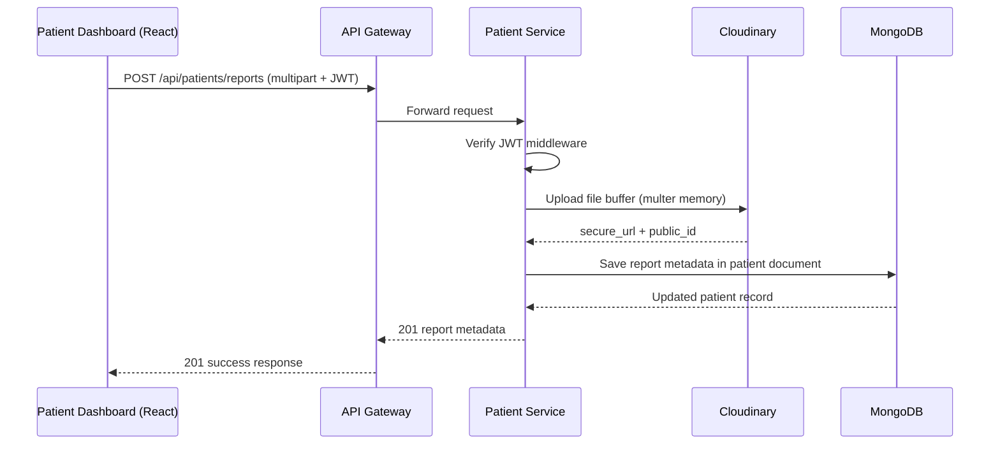
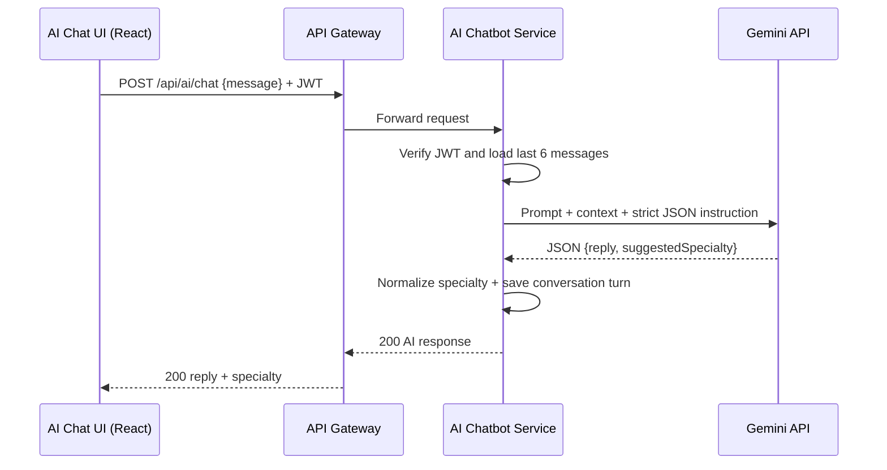

# Patient + AI Module Report

## 1. Service Interfaces

### Patient Management Service

Base path: `/api/patients`

| Method | Path | Request Body / Params | Response Shape |
|---|---|---|---|
| GET | `/api/patients/profile` | Header: `Authorization: Bearer <jwt>` | `{ success, message, data: { userId, fullName, dateOfBirth, bloodGroup, allergies, reports, medicalNotes, ... } }` |
| PUT | `/api/patients/profile` | `{ fullName, email, dateOfBirth, bloodGroup, contactNumber, address, allergies[], medicalNotes }` | `{ success, message, data: updatedProfile }` |
| POST | `/api/patients/reports` | `multipart/form-data` with file field `file` | `{ success, message, data: { filename, url, publicId, uploadDate, ... } }` |
| GET | `/api/patients/reports` | Header: `Authorization` | `{ success, message, data: [reportMetadata] }` |
| GET | `/api/patients/history` | Query: `page`, `limit`, optional `status` | `{ success, message, data: { items: [appointments], pagination } }` |
| GET | `/api/patients/prescriptions` | Query: `limit` | `{ success, message, data: { source, items: [prescriptions] } }` |

Internal endpoint for service-to-service use:

| Method | Path | Security | Response |
|---|---|---|---|
| GET | `/internal/patients/:patientId` | Header: `x-internal-service-secret` | `{ success, message, data: patientProfile }` |

### AI Chatbot Service (Gemini)

Base path: `/api/ai`

| Method | Path | Request Body | Response Shape |
|---|---|---|---|
| POST | `/api/ai/chat` | `{ message: "I have headache and fever" }` | `{ success, message, data: { reply, suggestedSpecialty } }` |

## 2. System Prompt Strategy (Gemini)

The chatbot prompt enforces these constraints:

- Act as a healthcare triage assistant only.
- Provide preliminary guidance only.
- Never claim diagnosis.
- Always include a disclaimer to consult a licensed doctor.
- Always return one specialty from a fixed list (for booking integration).
- Return strict JSON format: `{ "reply": "...", "suggestedSpecialty": "..." }`.

Conversation history strategy:

- In-memory per patient ID.
- Last 6 messages retained and sent as context with each request.
- New user/assistant messages overwrite older ones beyond this limit.

## 3. Workflow Diagrams

### Patient Uploads a Report

### Patient Uses AI Chatbot

## 4. Authentication Design

- Authentication is delegated to existing auth-service.
- Patient-service and AI chatbot service validate JWTs using shared `JWT_ACCESS_SECRET` from environment variables.
- JWT validation middleware runs before protected handlers.
- Internal service endpoint in patient-service uses `x-internal-service-secret`.
- Secrets are externalized into Docker/Kubernetes environment variables and Kubernetes Secret objects.

## 5. AI Safety Note

The chatbot is explicitly implemented as an AI-assisted preliminary support tool and not a diagnostic system. Every response includes a doctor-consultation disclaimer and a specialty suggestion for appointment routing.

## 6. Individual Contribution Statement

Implemented Patient Management Service (Node.js + MongoDB + Cloudinary upload), AI Chatbot Service (Node.js + Gemini API integration with context memory), patient dashboard pages in React (`/dashboard`, `/profile`, `/reports`, `/history`, `/ai-chat`), and Docker/Kubernetes configurations for these services.
